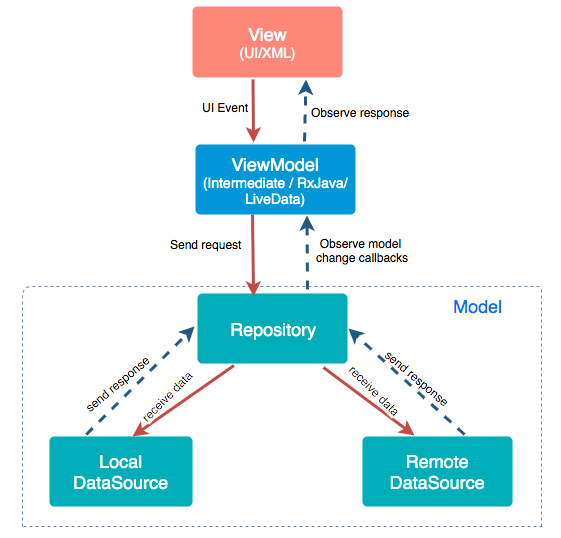

**An Android app that makes use of the following API to display a list of Albums sorted by title**:

Api - https://jsonplaceholder.typicode.com/

List of albums -> https://jsonplaceholder.typicode.com/albums

1. When the user opens the app, the app makes an Api Call to fetch the list of Albums using the retrofit library 
   and stores the album list in the local database(Room Persistence library) for offline use. 

2. If there is no internet connection, the app displays a warning to the user to connect to the internet 
   and if App database has offline albums to show then it will display the albums from the database 
   or it will show an error if the app has never been successfully connected to the api.

3.  App automatically fetch & refresh data from server as soon as it is connected back to the internet.

The app employs MVVM ( Model-View-ViewModel architecture) and Repository design patterns. 
The view observes LiveData collected in the ViewModel. Api and persistence operations are run off the main thread using coroutines. 
Implemented some unit tests to test ViewModel & App Database.

#### Used language and libraries
* **[Kotlin]**- Primary project language
* **[Android Architecture Components]** - **MVVM** pattern
* **[Retrofit]**(http://square.github.io/retrofit/) - to perform API call
* **[Room]** - The Room persistence library creates and maintains this database for you.
* **[LiveData]** - A data holder class that can be observed. Notifies its observers when the data has changed. LiveData is lifecycle aware. UI components just observe relevant data and don’t stop or resume observation. LiveData automatically manages all of this since it’s aware of the relevant lifecycle status changes while observing.
* **[Coroutines]**: Allow us to write asynchronous code in a sequential fashion.

**Future Improvements** : 

* Create base classes such as BaseActivity for AlbumsActivity class to handle network connection functions in a better way.
* Implement Dependency Inject Framework - Dagger or Hilt in the project.
* Implement Data Binding to bind UI components to data sources.
* Add some more tests for ex. Test case for when user is offline, Test case when user is connected back to Internet and UI tests for Activity.
* Add more details about the album for ex. showing photos inside a Album with the information of the user who posted the album.
* Add Pagination to list of Albums so that all albums don’t load at the same time. Maximum 20 Albums should load at once and when the user scrolls, the next set of 20 albums loads and so on.

